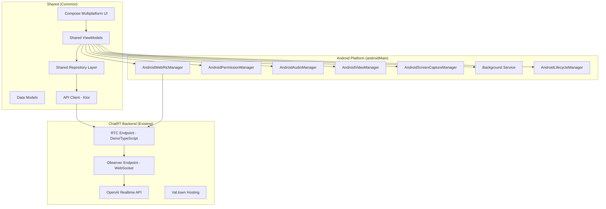

# Design Document

## Overview

The ChatRT Android frontend is a cross-platform application built using Kotlin Multiplatform (KMP) with Compose Multiplatform for the UI, designed with Android as the primary target. The app delivers a mobile-optimized Android experience that provides real-time voice and video communication with OpenAI's Realtime API through the existing ChatRT backend infrastructure, while maintaining a well-designed KMP codebase for future platform expansion.

The application connects to the existing ChatRT backend (built with Deno/TypeScript and hosted on Val.town) which handles WebRTC signaling and OpenAI Realtime API integration. The Android app focuses on providing native mobile capabilities including optimized camera/microphone access, background processing, mobile-specific UI patterns, and Android system integration features like phone call interruption handling and battery optimization.

The architecture follows MVVM pattern with Repository pattern for data management, leveraging Android-specific APIs (MediaProjection API for screen sharing, Camera2 API for camera access) while maintaining clean separation between shared business logic and platform-specific implementations using Kotlin Multiplatform's expect/actual pattern. The design prioritizes mobile user experience with touch-optimized controls, responsive layouts, and Material 3 Expressive UI design.

**Design Rationale**: Using Kotlin Multiplatform provides a well-designed, modern codebase architecture that enables future platform expansion while focusing on Android-first design (Requirement 6.3). The Material 3 Expressive UI ensures users see a cutting-edge, well-designed interface (Requirement 6.2). Integration with the existing ChatRT backend maintains consistency with the web frontend while leveraging proven WebRTC and OpenAI integration.

## Architecture

### High-Level Architecture



### Technology Stack

#### Shared (Common) Technologies

- **Language**: Kotlin Multiplatform (Requirement 6.3)
- **UI Framework**: Compose Multiplatform
- **UI Theme**: Material 3 Expressive Theme (experimental - Requirement 6.2)
- **Architecture**: MVVM with Repository Pattern
- **HTTP Client**: Ktor Client (multiplatform)
- **Serialization**: Kotlinx Serialization (latest version - Requirement 6.1)
- **Coroutines**: Kotlinx Coroutines (latest version - Requirement 6.1)
- **DateTime**: Kotlinx DateTime (latest version - Requirement 6.1)

#### Android Platform Integration (androidMain)

- **WebRTC**: WebRTC Android SDK (org.webrtc:google-webrtc - latest version)
- **Dependency Injection**: Koin (multiplatform compatible - latest version)
- **Permissions**: Accompanist Permissions (latest version)
- **Media**: Android Camera2 API, MediaProjection API
- **Audio**: AudioManager, AudioAttributes, AudioFocusRequest
- **Lifecycle**: Android Architecture Components (latest version)
- **Background Services**: Foreground Service for call continuity
- **Notifications**: NotificationManager for persistent status
- **System Integration**: TelephonyManager for call detection

## Components and Interfaces

### 1. Shared UI Layer (Compose Multiplatform)

#### Shared Composable Screens

- **MainScreen**: Primary interface with connection controls (shared across platforms)
- **SettingsScreen**: Configuration and preferences (shared across platforms)
- **PermissionScreen**: Permission request handling (platform-specific implementations)

#### Shared UI Components

- **ConnectionStatusIndicator**: Real-time connection status with visual feedback using Material 3 Expressive Theme (Requirement 6.2)
  - Loading indicator with connection progress (Requirement 4.1)
  - Green indicator and "Connected" status when established (Requirement 4.2)
  - Error messages with suggested actions for connection issues (Requirement 4.3)
- **VideoModeSelector**: Radio button group for audio/video/screen modes with expressive animations (Requirement 6.2)
  - "Start Voice Chat" button for audio-only mode (Requirement 1.2)
  - "Video Chat" mode selection with camera preview (Requirement 2.1)
  - "Screen Share" mode selection with permission handling (Requirement 3.1)
- **VideoPreview**: Camera or screen capture preview with Material 3 Expressive styling (Requirement 6.2)
  - Front-facing camera feed by default with rear camera option (Requirement 2.2)
  - Camera switch button for toggling between cameras (Requirement 2.4)
  - Proper video orientation and aspect ratio handling (Requirement 2.5)
- **LogsDisplay**: Real-time logging with timestamps using expressive typography (Requirement 6.2)
  - Debug mode toggle for showing WebRTC events and API calls (Requirement 4.4)
  - Real-time logs with different severity levels and timestamps
- **ControlButtons**: Start/stop, settings, camera switch with Material 3 Expressive Theme animations and interactions (Requirement 6.2)
  - "End Chat" button for graceful connection termination (Requirement 1.6)
  - Mobile-optimized touch targets and gesture support

#### Platform-Specific UI Integration

##### Android (androidMain)

- **MainActivity**: Single activity hosting the Compose Multiplatform UI
  - Clean, mobile-optimized interface with clear audio connection controls (Requirement 1.1)
  - Material 3 Expressive UI implementation (Requirement 6.2)
  - Handles microphone and camera permission requests (Requirements 1.2, 2.1)
  - Manages device orientation changes while maintaining video aspect ratios (Requirement 2.5)
- **System Integration**: Comprehensive Android-specific behavior handling
  - Incoming phone call detection with automatic ChatRT session pause/resume (Requirement 5.2)
  - Headphone connection/disconnection with automatic audio routing (Requirement 5.3)
  - Background processing maintenance during active calls (Requirement 5.1)
  - Proper resource cleanup when app is terminated by system (Requirement 5.5)
- **Permission Handling**: Native Android permission management
  - Microphone permissions for voice chat (Requirement 1.2)
  - Camera permissions with fallback to audio-only mode (Requirement 2.6)
  - Screen recording permissions through MediaProjection API (Requirement 3.1, 3.6)

### 2. Shared ViewModel Layer

#### MainViewModel (Shared)

````kotlin
class MainViewModel(
    private val chatRepository: ChatRepository,
    private val platformManager: PlatformManager
) : ViewModel() {

    private val _connectionState = MutableStateFlow(ConnectionState.DISCONNECTED)
    val connectionState: StateFlow<ConnectionState> = _connectionState.asStateFlow()

    private val _videoMode = MutableStateFlow(VideoMode.AUDIO_ONLY)
    val videoMode: StateFlow<VideoMode> = _videoMode.asStateFlow()

    private val _logs = MutableStateFlow<List<LogEntry>>(emptyList())
    val logs: StateFlow<List<LogEntry>> = _logs.asStateFlow()

    private val _isCallPaused = MutableStateFlow(false)
    val isCallPaused: StateFlow<Boolean> = _isCallPaused.asStateFlow()

    fun startConnection()
    fun stopConnection()
    fun setVideoMode(mode: VideoMode)
    fun switchCamera()

    // Platform-agnostic lifecycle management
    fun handleAppBackground()
    fun handleAppForeground()
    fun handleSystemInterruption()
    fun resumeAfterInterruption()

    // System adaptation (delegated to platform manager)
    fun handleResourceConstraints()
    fun applyPlatformOptimization(optimization: PlatformOptimization)
}

#### SettingsViewModel (Shared)
```kotlin
class SettingsViewModel(
    private val settingsRepository: SettingsRepository
) : ViewModel() {

    val defaultVideoMode: StateFlow<VideoMode>
    val audioQuality: StateFlow<AudioQuality>
    val debugLogging: StateFlow<Boolean>
    val serverUrl: StateFlow<String>

    fun updateDefaultVideoMode(mode: VideoMode)
    fun updateAudioQuality(quality: AudioQuality)
    fun toggleDebugLogging()
    fun updateServerUrl(url: String)
}
````

### 3. Shared Repository Layer

#### ChatRepository (Shared Interface)

```kotlin
interface ChatRepository {
    suspend fun createCall(sdpOffer: String): Result<String>
    fun observeConnectionState(): Flow<ConnectionState>
    fun observeLogs(): Flow<List<LogEntry>>
}

class ChatRepositoryImpl(
    private val webRtcManager: WebRtcManager,
    private val apiService: ChatRtApiService
) : ChatRepository {

    override suspend fun createCall(sdpOffer: String): Result<String> {
        return try {
            val response = apiService.createCall(sdpOffer)
            Result.success(response)
        } catch (e: Exception) {
            Result.failure(e)
        }
    }
}
```

#### SettingsRepository (Shared Interface)

```kotlin
interface SettingsRepository {
    suspend fun getDefaultVideoMode(): VideoMode
    suspend fun setDefaultVideoMode(mode: VideoMode)
    suspend fun getAudioQuality(): AudioQuality
    suspend fun setAudioQuality(quality: AudioQuality)
    // Additional settings methods
}

// Platform-specific implementations will handle storage differently
// Android: SharedPreferences or DataStore
// Future platforms: Platform-appropriate storage mechanisms
```

````

### 4. Platform Abstraction Layer

#### PlatformManager (Shared Interface)
```kotlin
interface PlatformManager {
    fun requestPermissions(permissions: List<Permission>): Flow<PermissionResult>
    fun createWebRtcManager(): WebRtcManager
    fun createAudioManager(): AudioManager
    fun createVideoManager(): VideoManager
    fun createScreenCaptureManager(): ScreenCaptureManager
    fun handleSystemInterruption(): SystemInterruption
    fun getResourceConstraints(): ResourceConstraints
    fun createPlatformOptimization(): PlatformOptimization
}

// Platform-specific implementations using expect/actual pattern
// AndroidPlatformManager (androidMain)
// Future platform managers for other targets
````

### 5. WebRTC Management (Platform-Specific Implementations)

#### WebRtcManager (Shared Interface)

```kotlin
interface WebRtcManager {
    fun initialize()
    fun createOffer(): SessionDescription
    fun setRemoteDescription(sdp: SessionDescription)
    fun addLocalStream(stream: MediaStream)
    fun setRemoteAudioSink(audioSink: AudioTrackSink)
    fun close()
    fun setConnectionStateCallback(callback: (PeerConnection.PeerConnectionState) -> Unit)
}

// Android Implementation (androidMain)
class AndroidWebRtcManager(
    private val context: Context,
    private val audioManager: AudioManager
) : WebRtcManager {

    private var peerConnection: PeerConnection? = null
    private var localVideoTrack: VideoTrack? = null
    private var localAudioTrack: AudioTrack? = null

    // Android-specific WebRTC implementation
    fun handleNetworkChange()
    fun optimizeForBattery()
    fun adaptToNetworkQuality(quality: NetworkQuality)
}
```

#### VideoManager

```kotlin
interface VideoManager {
    fun createCameraStream(frontFacing: Boolean = true): MediaStream
    fun createScreenCaptureStream(mediaProjectionData: Intent): MediaStream
    fun switchCamera()
    fun stopCapture()
    fun isFrontCameraAvailable(): Boolean
    fun isBackCameraAvailable(): Boolean
}

// Android Implementation (androidMain)
class AndroidVideoManager @Inject constructor(
    private val context: Context
) : VideoManager {

    private var videoCapturer: VideoCapturer? = null
    private var videoSource: VideoSource? = null
    private var cameraEnumerator: CameraEnumerator? = null

    // Android-specific camera features
    fun handleOrientationChange(orientation: Int)
    fun optimizeForBattery()
    fun adaptVideoQuality(quality: VideoQuality)
}
```

#### AudioManager

```kotlin
interface AudioManager {
    fun setupAudioRouting()
    fun handleAudioFocusChange(focusChange: Int)
    fun setAudioMode(mode: AudioMode)
    fun handleHeadsetConnection(connected: Boolean)
    fun getAvailableAudioDevices(): List<AudioDevice>
    fun setAudioDevice(device: AudioDevice)
}

// Android Implementation (androidMain)
class AndroidAudioManager @Inject constructor(
    private val context: Context,
    private val systemAudioManager: android.media.AudioManager
) : AudioManager {

    // Android-specific audio features
    fun handlePhoneCallInterruption()
    fun resumeAfterPhoneCall()
    fun optimizeForBattery()
}
```

### 6. Permission Management

#### PermissionManager

```kotlin
interface PermissionManager {
    fun checkMicrophonePermission(): Boolean
    fun checkCameraPermission(): Boolean
    fun checkScreenCapturePermission(): Boolean
    suspend fun requestMicrophonePermission(): Boolean
    suspend fun requestCameraPermission(): Boolean
    suspend fun requestScreenCapturePermission(): Intent?
    fun shouldShowRationale(permission: String): Boolean
}

// Android Implementation (androidMain)
class AndroidPermissionManager @Inject constructor(
    private val context: Context
) : PermissionManager {
    
    fun navigateToAppSettings()
    fun handlePermissionDenied(permission: String)
}
```

### 7. Screen Capture Management

#### ScreenCaptureManager

```kotlin
interface ScreenCaptureManager {
    fun requestScreenCapturePermission(): Intent?
    fun startScreenCapture(data: Intent): MediaStream
    fun stopScreenCapture()
    fun isScreenCaptureActive(): Boolean
    fun enableBackgroundScreenSharing()
    fun disableBackgroundScreenSharing()
    fun showScreenCaptureNotification()
    fun hideScreenCaptureNotification()
}

// Android Implementation (androidMain)
class AndroidScreenCaptureManager @Inject constructor(
    private val context: Context
) : ScreenCaptureManager {

    private var mediaProjection: MediaProjection? = null
    private var virtualDisplay: VirtualDisplay? = null

    // Permission handling (Requirement 3.6)
    fun handlePermissionDenied(): ScreenCaptureError
}
```

### 8. Background Service Management

#### ChatRtService

```kotlin
class ChatRtService : Service() {

    private val binder = ChatRtBinder()
    private var isCallActive = false

    inner class ChatRtBinder : Binder() {
        fun getService(): ChatRtService = this@ChatRtService
    }

    fun startCall(connectionParams: ConnectionParams)
    fun endCall()
    fun pauseCall() // For phone call interruptions
    fun resumeCall()

    // Foreground service management
    private fun startForegroundService()
    private fun stopForegroundService()

    // Phone call detection
    private fun registerPhoneStateListener()
    private fun unregisterPhoneStateListener()
}
```

### 9. Lifecycle and System Integration

#### LifecycleManager

```kotlin
interface LifecycleManager {
    fun handleAppBackground()
    fun handleAppForeground()
    fun handleSystemInterruption()
    fun resumeAfterInterruption()
}

// Android Implementation (androidMain)
class AndroidLifecycleManager @Inject constructor(
    private val context: Context,
    private val telephonyManager: TelephonyManager
) : LifecycleManager {

    private var phoneStateListener: PhoneStateListener? = null

    fun handlePhoneCallStart()
    fun handlePhoneCallEnd()
    fun handleDeviceOrientationChange(orientation: Int)

    // Battery optimization
    fun handleLowBattery(): BatteryOptimization
    fun requestBatteryOptimizationExemption()
}
```

#### NetworkMonitor

```kotlin
interface NetworkMonitor {
    fun startMonitoring()
    fun stopMonitoring()
    fun getCurrentNetworkQuality(): NetworkQuality
    fun adaptStreamingQuality(quality: NetworkQuality)
}

// Android Implementation (androidMain)
class AndroidNetworkMonitor @Inject constructor(
    private val context: Context,
    private val connectivityManager: ConnectivityManager
) : NetworkMonitor {

    private val networkCallback = object : ConnectivityManager.NetworkCallback() {
        override fun onAvailable(network: Network) { /* Handle network available */ }
        override fun onLost(network: Network) { /* Handle network lost */ }
        override fun onCapabilitiesChanged(network: Network, capabilities: NetworkCapabilities) {
            // Handle bandwidth/quality changes
        }
    }
}
```

#### BatteryMonitor

```kotlin
interface BatteryMonitor {
    fun getCurrentBatteryLevel(): Int
    fun isBatteryLow(): Boolean
    fun registerBatteryLevelReceiver()
    fun unregisterBatteryLevelReceiver()
    fun suggestPowerSavingMode(): PowerSavingRecommendation
    fun applyPowerSavingMode(mode: PowerSavingMode)
}

// Android Implementation (androidMain)
class AndroidBatteryMonitor @Inject constructor(
    private val context: Context,
    private val batteryManager: BatteryManager
) : BatteryMonitor {
    // Android-specific battery monitoring implementation
}
```

## Data Models

### Core Data Classes

```kotlin
data class LogEntry(
    val timestamp: Long,
    val message: String,
    val level: LogLevel = LogLevel.INFO
)

enum class LogLevel {
    DEBUG, INFO, WARNING, ERROR
}

enum class ConnectionState {
    DISCONNECTED,
    CONNECTING,
    CONNECTED,
    FAILED,
    RECONNECTING
}

enum class VideoMode {
    AUDIO_ONLY,
    WEBCAM,
    SCREEN_SHARE
}

enum class AudioQuality {
    LOW,
    MEDIUM,
    HIGH
}

data class AppSettings(
    val defaultVideoMode: VideoMode = VideoMode.AUDIO_ONLY,
    val audioQuality: AudioQuality = AudioQuality.MEDIUM,
    val debugLogging: Boolean = false,
    val serverUrl: String = "",
    val defaultCamera: CameraFacing = CameraFacing.FRONT
)

enum class CameraFacing {
    FRONT, BACK
}

data class ConnectionParams(
    val videoMode: VideoMode,
    val audioQuality: AudioQuality,
    val cameraFacing: CameraFacing = CameraFacing.FRONT
)

enum class NetworkQuality {
    POOR, FAIR, GOOD, EXCELLENT
}

// Platform-agnostic optimization
data class PlatformOptimization(
    val recommendedVideoMode: VideoMode,
    val recommendedAudioQuality: AudioQuality,
    val disableVideoPreview: Boolean = false,
    val reason: OptimizationReason
)

enum class OptimizationReason {
    LOW_BATTERY,        // Android-specific
    HIGH_CPU_USAGE,     // Future platform-specific
    LOW_MEMORY,         // Both platforms
    POOR_NETWORK       // Both platforms
}

// Platform-specific data classes
data class SystemInterruption(
    val type: InterruptionType,
    val shouldPause: Boolean,
    val resumeAction: (() -> Unit)?
)

enum class InterruptionType {
    PHONE_CALL,         // Android-specific
    SYSTEM_CALL,        // Future platform-specific
    LOW_POWER_MODE,     // Both platforms
    NETWORK_LOSS        // Both platforms
}

data class ResourceConstraints(
    val availableMemory: Long,
    val cpuUsage: Float,
    val networkBandwidth: Long,
    val platformSpecific: Map<String, Any> = emptyMap()
)

enum class PowerSavingMode {
    NONE, MODERATE, AGGRESSIVE
}

data class PowerSavingRecommendation(
    val mode: PowerSavingMode,
    val reason: String,
    val estimatedBatteryGain: String
)
```

### API Models

```kotlin
data class CallRequest(
    val sdp: String,
    val session: SessionConfig
)

data class SessionConfig(
    val type: String = "realtime",
    val model: String = "gpt-realtime",
    val instructions: String,
    val audio: AudioConfig
)

data class AudioConfig(
    val input: AudioInputConfig,
    val output: AudioOutputConfig
)

data class AudioInputConfig(
    val noiseReduction: NoiseReductionConfig
)

data class NoiseReductionConfig(
    val type: String = "near_field"
)

data class AudioOutputConfig(
    val voice: String = "marin"
)
```

### Backend Integration Strategy

The Android app integrates with the existing ChatRT backend infrastructure to maintain consistency with the web frontend while leveraging proven WebRTC and OpenAI integration.

#### Existing ChatRT Backend Architecture

The ChatRT backend is built with:
- **Runtime**: Deno (TypeScript/JavaScript)
- **Hosting**: Val.town serverless platform
- **Framework**: Hono for lightweight web routing
- **WebRTC**: Server-side WebRTC signaling
- **OpenAI Integration**: Direct WebSocket connection to OpenAI Realtime API

#### Android App Integration Points

1. **WebRTC Signaling**: Android app connects to existing `/rtc` endpoint
   - Sends SDP offers created by Android WebRTC SDK
   - Receives SDP answers from ChatRT backend
   - Maintains compatibility with existing signaling protocol

2. **Session Management**: Leverages existing session configuration
   - Uses same SessionConfig format as web frontend
   - Maintains consistent audio configuration and model parameters
   - Supports same OpenAI Realtime API features (voice selection, noise reduction)

3. **Real-time Communication**: Direct WebRTC peer connection
   - Audio/video streams flow directly between Android app and OpenAI
   - Backend handles signaling and session establishment
   - Observer WebSocket provides connection monitoring

#### API Compatibility

The Android app maintains full API compatibility with the existing ChatRT backend:

```kotlin
// ChatRtApiService implementation
class ChatRtApiService(private val httpClient: HttpClient) {
    
    suspend fun createCall(sdpOffer: String): String {
        val request = CallRequest(
            sdp = sdpOffer,
            session = SessionConfig(
                type = "realtime",
                model = "gpt-realtime",
                instructions = "You are a helpful assistant.",
                audio = AudioConfig(
                    input = AudioInputConfig(
                        noiseReduction = NoiseReductionConfig(type = "near_field")
                    ),
                    output = AudioOutputConfig(voice = "marin")
                )
            )
        )
        
        return httpClient.post("/rtc") {
            contentType(ContentType.Application.Json)
            setBody(request)
        }.body()
    }
}
```

#### Configuration Management

The Android app supports the same configuration options as the web frontend:
- Server URL configuration for different ChatRT backend deployments
- Audio quality settings that map to backend session parameters
- Debug logging that integrates with backend observer endpoints

**Design Rationale**: Leveraging the existing ChatRT backend ensures consistency across platforms, reduces development complexity, and maintains proven WebRTC/OpenAI integration patterns. The Android app focuses on mobile-specific enhancements while preserving full feature compatibility.

## Error Handling

### Error Types

```kotlin
sealed class ChatRtError : Exception() {
    object NetworkError : ChatRtError()
    object PermissionDenied : ChatRtError()
    object WebRtcError : ChatRtError()
    object AudioDeviceError : ChatRtError()
    object CameraError : ChatRtError()
    object ScreenCaptureError : ChatRtError()
    object ServiceConnectionError : ChatRtError()
    object PhoneCallInterruptionError : ChatRtError()
    object BatteryOptimizationError : ChatRtError()
    object NetworkQualityError : ChatRtError()
    data class ApiError(val code: Int, val message: String) : ChatRtError()
}
```

### Error Handling Strategy

1. **Network Errors**: Automatic retry with exponential backoff, quality adaptation
2. **Permission Errors**: Clear user guidance and settings navigation
   - Camera permission denied: Fall back to audio-only mode with appropriate message (Requirement 2.6)
   - Screen sharing permission denied: Display error message and offer alternative modes (Requirement 3.6)
   - Microphone permission denied: Clear guidance for enabling permissions (Requirement 1.2)
3. **WebRTC Errors**: Connection state management and fallback options
   - Connection issues: Display appropriate error messages with suggested actions (Requirement 4.3)
   - Failed connections: Graceful return to initial state (Requirement 1.6)
4. **Device Errors**: Graceful degradation (e.g., audio-only fallback)
5. **API Errors**: User-friendly error messages with retry options
6. **Service Errors**: Automatic service restart and connection recovery
7. **Phone Call Interruptions**: Automatic pause/resume with user notification (Requirement 5.2)
8. **Battery Optimization**: Proactive quality reduction and user suggestions
9. **Network Quality Issues**: Dynamic streaming adaptation with user feedback
10. **System Resource Cleanup**: Proper WebRTC connection cleanup when app is terminated (Requirement 5.5)

### Logging Strategy

- **Debug Logs**: Detailed WebRTC events, API calls, state changes, system events
- **Info Logs**: User actions, connection events, mode changes, lifecycle transitions
- **Warning Logs**: Recoverable errors, fallback activations, battery optimizations
- **Error Logs**: Critical failures, unrecoverable states, service interruptions

## Platform-Specific Design Considerations

### Shared Design Principles

The multiplatform architecture follows these core principles:

1. **Shared Business Logic**: ViewModels, repositories, and data models are shared across platforms (Requirement 6.3)
2. **Platform-Specific UI**: While using Compose Multiplatform, platform-specific UI adaptations are made
3. **Expect/Actual Pattern**: Platform-specific implementations use Kotlin's expect/actual mechanism (Requirement 6.3)
4. **Dependency Injection**: Koin provides multiplatform dependency injection with platform-specific modules
5. **Latest Technology Stack**: All dependencies are kept up to date (Requirement 6.1)
6. **Material 3 Expressive UI**: Users see a well-designed, modern interface (Requirement 6.2)

**Design Rationale**: This approach maximizes code reuse while allowing platform-specific optimizations and native integrations. The well-designed KMP codebase enables future platform expansion while maintaining cutting-edge technology standards.

### Material 3 Expressive Theme Integration

The application leverages Material 3 Expressive Theme (experimental) to provide a modern, personalized user interface:

#### Theme Features

1. **Expressive Theming**: Customizable Material Design for a more personalized experience
2. **Motion Scheme**: Enhanced motion design system with configurable animation behaviors
3. **Advanced Shapes**: More expressive shape system for UI components
4. **Typography System**: Enhanced typography with expressive font configurations

#### Implementation Strategy

```kotlin
// Shared theme configuration with Material 3 Expressive Theme
@OptIn(ExperimentalMaterial3ExpressiveApi::class)
@Composable
fun ChatRtTheme(
    darkTheme: Boolean = isSystemInDarkTheme(),
    content: @Composable () -> Unit
) {
    val colorScheme = if (darkTheme) {
        darkColorScheme()
    } else {
        lightColorScheme()
    }

    MaterialExpressiveTheme(
        colorScheme = colorScheme,
        motionScheme = MotionScheme.expressive(),
        shapes = ExpressiveShapes,
        typography = ExpressiveTypography,
        content = content
    )
}
```

#### Dependencies (Latest Versions - Requirement 6.1)

- **Material 3 Experimental**: `org.jetbrains.compose.material3:material3:1.9.0-alpha04` (latest)
- **Compose Multiplatform**: Latest stable version
- **Requires**: `@OptIn(ExperimentalMaterial3ExpressiveApi::class)` annotation

#### Platform Adaptations

- **Android**: Full Material 3 Expressive Theme support with system dynamic colors
- **Future Platforms**: Material 3 Expressive Theme adapted for platform-specific interaction patterns
- **Components**: Button(), Checkbox(), and other Material components automatically use expressive theming (Requirement 6.2)

**Design Rationale**: Material 3 Expressive Theme provides a cutting-edge, personalized, and visually appealing interface that allows for more customization and expressiveness while maintaining Material Design principles (Requirement 6.2). This ensures users see a well-designed, modern UI that meets the latest technology stack requirements.

### Mobile-Optimized UI Design

The Android app prioritizes mobile-first design principles to deliver an optimal touch-based experience:

#### Touch-Optimized Interface Design

1. **Large Touch Targets**: All interactive elements meet Android's minimum 48dp touch target size
2. **Clear Visual Hierarchy**: Mobile-optimized interface with clear audio connection controls (Requirement 1.1)
3. **Gesture Support**: Native Android gestures for common actions (swipe, pinch-to-zoom for video preview)
4. **Thumb-Friendly Layout**: Critical controls positioned within comfortable thumb reach zones

#### Responsive Layout System

1. **Portrait/Landscape Adaptation**: UI components reflow appropriately for device orientation (Requirement 2.5)
2. **Video Aspect Ratio Management**: Camera and screen sharing maintain proper aspect ratios across orientations (Requirement 2.5)
3. **Dynamic Content Sizing**: Text and UI elements scale appropriately for different screen densities
4. **Safe Area Handling**: Proper handling of notches, rounded corners, and navigation bars

#### Mobile Interaction Patterns

1. **Bottom Sheet Navigation**: Settings and advanced options accessible via bottom sheets
2. **Floating Action Buttons**: Primary actions (start/stop chat) prominently displayed
3. **Snackbar Feedback**: Non-intrusive feedback for user actions and system events
4. **Pull-to-Refresh**: Intuitive gesture for refreshing connection status

#### Performance Optimizations for Mobile

1. **Lazy Loading**: UI components loaded on-demand to reduce memory footprint
2. **Efficient Animations**: Hardware-accelerated animations using Compose's animation APIs
3. **Background Processing**: Minimal UI updates when app is backgrounded to preserve battery
4. **Memory Management**: Proper cleanup of video streams and UI resources during lifecycle changes

**Design Rationale**: Mobile-first design ensures the app feels native to Android users while providing optimal performance and usability on touch devices. The responsive design system adapts to various Android form factors while maintaining consistent user experience.

### Android-Specific Considerations

### Background Processing Strategy

The app implements a hybrid approach for background processing to ensure call continuity while respecting Android's background execution limits:

1. **Foreground Service**: When a call is active, the app runs a foreground service with a persistent notification
2. **Service Binding**: The UI binds to the service to maintain communication during foreground operation
3. **Graceful Degradation**: If the service is killed, the app attempts to reconnect when brought back to foreground

**Design Rationale**: This approach balances user experience (continuous calls) with system resource management and battery optimization.

### Phone Call Interruption Handling

The app integrates with Android's telephony system to handle incoming/outgoing phone calls:

1. **TelephonyManager Integration**: Monitors phone state changes using PhoneStateListener
2. **Automatic Pause/Resume**: ChatRT calls are paused when phone calls start and resumed when they end
3. **User Notification**: Clear visual feedback about call interruption status

**Design Rationale**: Seamless integration with the phone's primary calling functionality ensures a natural user experience.

### Battery Optimization Strategy

The app implements proactive battery management:

1. **Battery Level Monitoring**: Continuous monitoring of battery level and charging state
2. **Adaptive Quality**: Automatic reduction of video quality or switching to audio-only mode when battery is low
3. **User Control**: Users can override automatic optimizations or set preferences for battery-saving behavior

**Design Rationale**: Proactive battery management extends usage time while maintaining core functionality.

### Network Adaptation Design

The app dynamically adapts to network conditions:

1. **Real-time Monitoring**: Continuous monitoring of network capabilities and bandwidth
2. **Quality Adaptation**: Automatic adjustment of video resolution and audio bitrate based on network quality
3. **User Feedback**: Visual indicators show current network quality and any adaptations made

**Design Rationale**: Dynamic adaptation ensures the best possible experience across varying network conditions while preventing connection drops.

### Device Orientation and UI Adaptation

The app handles device orientation changes gracefully:

1. **State Preservation**: Connection state and video streams are maintained during orientation changes
2. **Adaptive Layouts**: UI components reflow appropriately for portrait/landscape orientations
3. **Video Aspect Ratio**: Camera and screen sharing maintain proper aspect ratios across orientations

**Design Rationale**: Seamless orientation handling provides a natural mobile experience without interrupting ongoing conversations.


## Testing Strategy

### Unit Testing

#### ViewModels

- State management logic
- Business logic validation
- Error handling scenarios
- Permission flow testing

#### Repositories

- API integration testing
- Data transformation logic
- Error response handling
- Caching behavior

#### Managers

- WebRTC connection lifecycle
- Audio routing logic
- Video capture functionality
- Permission state management

### Integration Testing

#### WebRTC Integration

- End-to-end connection establishment
- Audio/video stream handling
- Connection state transitions
- Error recovery scenarios

#### API Integration

- Backend communication
- SDP offer/answer exchange
- Session configuration
- Error response handling

### UI Testing

#### Compose Testing

- User interaction flows
- State-driven UI updates
- Permission request flows
- Error state displays

#### Instrumented Testing

- Camera functionality
- Microphone access
- Screen capture
- Audio routing

### Performance Testing

#### Memory Management

- WebRTC resource cleanup
- Video stream memory usage
- Background processing impact
- Garbage collection optimization

#### Battery Optimization

- Background processing limits
- CPU usage monitoring
- Network efficiency
- Power consumption analysis

### Device Testing Matrix

#### Android Versions

- Android 7.0 (API 24) - Minimum supported
- Android 8.0 (API 26) - Background execution limits
- Android 10 (API 29) - Scoped storage, privacy changes
- Android 11 (API 30) - Permission changes
- Android 12+ (API 31+) - Latest features and restrictions

#### Device Categories

- **Phones**: Various screen sizes and performance levels
- **Tablets**: Landscape orientation, larger screens
- **Foldables**: Dynamic screen configurations
- **Android TV**: Alternative input methods (if supported)

#### Hardware Variations

- **Cameras**: Front/back availability, resolution capabilities
- **Audio**: Speaker/headphone configurations, noise cancellation
- **Performance**: RAM, CPU capabilities, thermal throttling
- **Network**: WiFi, cellular, bandwidth variations
