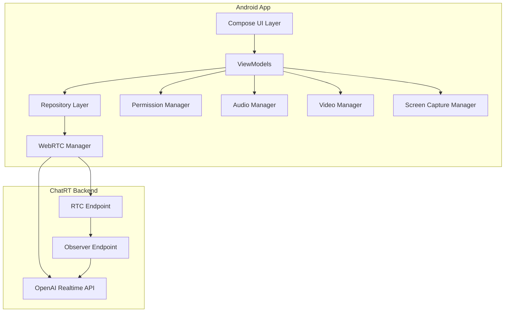

# Design Document

## Overview

The Android frontend for ChatRT will be a native Android application built using modern Android development practices. The app will provide a mobile-optimized interface for real-time voice and video communication with OpenAI's Realtime API through WebRTC. The design leverages Android's native capabilities while maintaining compatibility with the existing ChatRT backend infrastructure.

The application will be built using Kotlin with Jetpack Compose for the UI, WebRTC Android SDK for real-time communication, and Android's MediaProjection API for screen sharing. The architecture follows MVVM pattern with Repository pattern for data management and dependency injection for modularity.

## Architecture

### High-Level Architecture



### Technology Stack

- **Language**: Kotlin
- **UI Framework**: Jetpack Compose
- **Architecture**: MVVM with Repository Pattern
- **WebRTC**: WebRTC Android SDK (org.webrtc:google-webrtc)
- **HTTP Client**: Retrofit with OkHttp
- **Dependency Injection**: Hilt
- **Permissions**: Accompanist Permissions
- **Media**: Android Camera2 API, MediaProjection API
- **Audio**: AudioManager, AudioAttributes
- **Lifecycle**: Android Architecture Components

## Components and Interfaces

### 1. UI Layer (Jetpack Compose)

#### MainActivity
- Single activity hosting the entire app
- Handles system-level events (incoming calls, battery changes)
- Manages app lifecycle and background behavior

#### Composable Screens
- **MainScreen**: Primary interface with connection controls
- **SettingsScreen**: Configuration and preferences
- **PermissionScreen**: Permission request handling

#### UI Components
- **ConnectionStatusIndicator**: Real-time connection status with visual feedback
- **VideoModeSelector**: Radio button group for audio/video/screen modes
- **VideoPreview**: Camera or screen capture preview
- **LogsDisplay**: Real-time logging with timestamps
- **ControlButtons**: Start/stop, settings, camera switch

### 2. ViewModel Layer

#### MainViewModel
```kotlin
class MainViewModel @Inject constructor(
    private val chatRepository: ChatRepository,
    private val permissionManager: PermissionManager
) : ViewModel() {
    
    private val _connectionState = MutableStateFlow(ConnectionState.DISCONNECTED)
    val connectionState: StateFlow<ConnectionState> = _connectionState.asStateFlow()
    
    private val _videoMode = MutableStateFlow(VideoMode.AUDIO_ONLY)
    val videoMode: StateFlow<VideoMode> = _videoMode.asStateFlow()
    
    private val _logs = MutableStateFlow<List<LogEntry>>(emptyList())
    val logs: StateFlow<List<LogEntry>> = _logs.asStateFlow()
    
    fun startConnection()
    fun stopConnection()
    fun setVideoMode(mode: VideoMode)
    fun switchCamera()
}
```

#### SettingsViewModel
```kotlin
class SettingsViewModel @Inject constructor(
    private val settingsRepository: SettingsRepository
) : ViewModel() {
    
    val defaultVideoMode: StateFlow<VideoMode>
    val audioQuality: StateFlow<AudioQuality>
    val debugLogging: StateFlow<Boolean>
    val serverUrl: StateFlow<String>
    
    fun updateDefaultVideoMode(mode: VideoMode)
    fun updateAudioQuality(quality: AudioQuality)
    fun toggleDebugLogging()
    fun updateServerUrl(url: String)
}
```

### 3. Repository Layer

#### ChatRepository
```kotlin
interface ChatRepository {
    suspend fun createCall(sdpOffer: String): Result<String>
    fun observeConnectionState(): Flow<ConnectionState>
    fun observeLogs(): Flow<List<LogEntry>>
}

class ChatRepositoryImpl @Inject constructor(
    private val webRtcManager: WebRtcManager,
    private val apiService: ChatRtApiService
) : ChatRepository {
    
    override suspend fun createCall(sdpOffer: String): Result<String> {
        return try {
            val response = apiService.createCall(sdpOffer)
            Result.success(response)
        } catch (e: Exception) {
            Result.failure(e)
        }
    }
}
```

#### SettingsRepository
```kotlin
interface SettingsRepository {
    suspend fun getDefaultVideoMode(): VideoMode
    suspend fun setDefaultVideoMode(mode: VideoMode)
    suspend fun getAudioQuality(): AudioQuality
    suspend fun setAudioQuality(quality: AudioQuality)
    // Additional settings methods
}
```

### 4. WebRTC Management

#### WebRtcManager
```kotlin
class WebRtcManager @Inject constructor(
    private val context: Context,
    private val audioManager: AudioManager
) {
    
    private var peerConnection: PeerConnection? = null
    private var localVideoTrack: VideoTrack? = null
    private var localAudioTrack: AudioTrack? = null
    
    fun initialize()
    fun createOffer(): SessionDescription
    fun setRemoteDescription(sdp: SessionDescription)
    fun addLocalStream(stream: MediaStream)
    fun setRemoteAudioSink(audioSink: AudioTrackSink)
    fun close()
    
    // Connection state callbacks
    fun setConnectionStateCallback(callback: (PeerConnection.PeerConnectionState) -> Unit)
}
```

#### VideoManager
```kotlin
class VideoManager @Inject constructor(
    private val context: Context
) {
    
    private var videoCapturer: VideoCapturer? = null
    private var videoSource: VideoSource? = null
    
    fun createCameraStream(frontFacing: Boolean = true): MediaStream
    fun createScreenCaptureStream(mediaProjectionData: Intent): MediaStream
    fun switchCamera()
    fun stopCapture()
    
    // Camera availability and capabilities
    fun isFrontCameraAvailable(): Boolean
    fun isBackCameraAvailable(): Boolean
}
```

#### AudioManager
```kotlin
class AudioManager @Inject constructor(
    private val context: Context,
    private val systemAudioManager: android.media.AudioManager
) {
    
    fun setupAudioRouting()
    fun handleAudioFocusChange(focusChange: Int)
    fun setAudioMode(mode: AudioMode)
    fun handleHeadsetConnection(connected: Boolean)
    
    // Audio device management
    fun getAvailableAudioDevices(): List<AudioDevice>
    fun setAudioDevice(device: AudioDevice)
}
```

### 5. Permission Management

#### PermissionManager
```kotlin
class PermissionManager @Inject constructor(
    private val context: Context
) {
    
    fun checkMicrophonePermission(): Boolean
    fun checkCameraPermission(): Boolean
    fun checkScreenCapturePermission(): Boolean
    
    suspend fun requestMicrophonePermission(): Boolean
    suspend fun requestCameraPermission(): Boolean
    suspend fun requestScreenCapturePermission(): Intent?
    
    fun shouldShowRationale(permission: String): Boolean
}
```

### 6. Screen Capture Management

#### ScreenCaptureManager
```kotlin
class ScreenCaptureManager @Inject constructor(
    private val context: Context
) {
    
    private var mediaProjection: MediaProjection? = null
    private var virtualDisplay: VirtualDisplay? = null
    
    fun startScreenCapture(data: Intent): MediaStream
    fun stopScreenCapture()
    fun isScreenCaptureActive(): Boolean
    
    // Notification management for screen recording
    fun showScreenCaptureNotification()
    fun hideScreenCaptureNotification()
}
```

## Data Models

### Core Data Classes

```kotlin
data class LogEntry(
    val timestamp: Long,
    val message: String,
    val level: LogLevel = LogLevel.INFO
)

enum class LogLevel {
    DEBUG, INFO, WARNING, ERROR
}

enum class ConnectionState {
    DISCONNECTED,
    CONNECTING,
    CONNECTED,
    FAILED,
    RECONNECTING
}

enum class VideoMode {
    AUDIO_ONLY,
    WEBCAM,
    SCREEN_SHARE
}

enum class AudioQuality {
    LOW,
    MEDIUM,
    HIGH
}

data class AppSettings(
    val defaultVideoMode: VideoMode = VideoMode.AUDIO_ONLY,
    val audioQuality: AudioQuality = AudioQuality.MEDIUM,
    val debugLogging: Boolean = false,
    val serverUrl: String = "",
    val defaultCamera: CameraFacing = CameraFacing.FRONT
)

enum class CameraFacing {
    FRONT, BACK
}
```

### API Models

```kotlin
data class CallRequest(
    val sdp: String,
    val session: SessionConfig
)

data class SessionConfig(
    val type: String = "realtime",
    val model: String = "gpt-realtime",
    val instructions: String,
    val audio: AudioConfig
)

data class AudioConfig(
    val input: AudioInputConfig,
    val output: AudioOutputConfig
)

data class AudioInputConfig(
    val noiseReduction: NoiseReductionConfig
)

data class NoiseReductionConfig(
    val type: String = "near_field"
)

data class AudioOutputConfig(
    val voice: String = "marin"
)
```

## Error Handling

### Error Types

```kotlin
sealed class ChatRtError : Exception() {
    object NetworkError : ChatRtError()
    object PermissionDenied : ChatRtError()
    object WebRtcError : ChatRtError()
    object AudioDeviceError : ChatRtError()
    object CameraError : ChatRtError()
    object ScreenCaptureError : ChatRtError()
    data class ApiError(val code: Int, val message: String) : ChatRtError()
}
```

### Error Handling Strategy

1. **Network Errors**: Automatic retry with exponential backoff
2. **Permission Errors**: Clear user guidance and settings navigation
3. **WebRTC Errors**: Connection state management and fallback options
4. **Device Errors**: Graceful degradation (e.g., audio-only fallback)
5. **API Errors**: User-friendly error messages with retry options

### Logging Strategy

- **Debug Logs**: Detailed WebRTC events, API calls, state changes
- **Info Logs**: User actions, connection events, mode changes
- **Warning Logs**: Recoverable errors, fallback activations
- **Error Logs**: Critical failures, unrecoverable states

## Testing Strategy

### Unit Testing

#### ViewModels
- State management logic
- Business logic validation
- Error handling scenarios
- Permission flow testing

#### Repositories
- API integration testing
- Data transformation logic
- Error response handling
- Caching behavior

#### Managers
- WebRTC connection lifecycle
- Audio routing logic
- Video capture functionality
- Permission state management

### Integration Testing

#### WebRTC Integration
- End-to-end connection establishment
- Audio/video stream handling
- Connection state transitions
- Error recovery scenarios

#### API Integration
- Backend communication
- SDP offer/answer exchange
- Session configuration
- Error response handling

### UI Testing

#### Compose Testing
- User interaction flows
- State-driven UI updates
- Permission request flows
- Error state displays

#### Instrumented Testing
- Camera functionality
- Microphone access
- Screen capture
- Audio routing

### Performance Testing

#### Memory Management
- WebRTC resource cleanup
- Video stream memory usage
- Background processing impact
- Garbage collection optimization

#### Battery Optimization
- Background processing limits
- CPU usage monitoring
- Network efficiency
- Power consumption analysis

### Device Testing Matrix

#### Android Versions
- Android 7.0 (API 24) - Minimum supported
- Android 8.0 (API 26) - Background execution limits
- Android 10 (API 29) - Scoped storage, privacy changes
- Android 11 (API 30) - Permission changes
- Android 12+ (API 31+) - Latest features and restrictions

#### Device Categories
- **Phones**: Various screen sizes and performance levels
- **Tablets**: Landscape orientation, larger screens
- **Foldables**: Dynamic screen configurations
- **Android TV**: Alternative input methods (if supported)

#### Hardware Variations
- **Cameras**: Front/back availability, resolution capabilities
- **Audio**: Speaker/headphone configurations, noise cancellation
- **Performance**: RAM, CPU capabilities, thermal throttling
- **Network**: WiFi, cellular, bandwidth variations