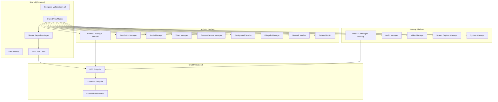

# Design Document

## Overview

The ChatRT frontend will be a cross-platform application built using Kotlin Multiplatform (KMP) with Compose Multiplatform for the UI. The app will provide a mobile-optimized interface for Android and a desktop interface for JVM platforms, enabling real-time voice and video communication with OpenAI's Realtime API through WebRTC. The design leverages shared business logic across platforms while maintaining platform-specific implementations for native capabilities.

The application will be built using Kotlin Multiplatform with Compose Multiplatform for the UI, platform-specific WebRTC SDKs for real-time communication, and platform-specific APIs for media access (Android's MediaProjection API for screen sharing, Camera2 API for camera access). The architecture follows MVVM pattern with Repository pattern for data management and dependency injection for modularity, with shared ViewModels and repositories across platforms.

## Architecture

### High-Level Architecture



### Technology Stack

#### Shared (Common)

- **Language**: Kotlin Multiplatform
- **UI Framework**: Compose Multiplatform
- **UI Theme**: Material 3 Expressive Theme (experimental - requires opt-in)
- **Architecture**: MVVM with Repository Pattern
- **HTTP Client**: Ktor Client (multiplatform)
- **Serialization**: Kotlinx Serialization
- **Coroutines**: Kotlinx Coroutines
- **DateTime**: Kotlinx DateTime

#### Android-Specific

- **WebRTC**: WebRTC Android SDK (org.webrtc:google-webrtc)
- **Dependency Injection**: Koin (multiplatform compatible)
- **Permissions**: Accompanist Permissions
- **Media**: Android Camera2 API, MediaProjection API
- **Audio**: AudioManager, AudioAttributes, AudioFocusRequest
- **Lifecycle**: Android Architecture Components
- **Background Services**: Foreground Service for call continuity
- **Notifications**: NotificationManager for persistent status
- **System Integration**: TelephonyManager for call detection, BatteryManager for power optimization

#### Desktop (JVM) Specific

- **WebRTC**: WebRTC Java SDK
- **Media**: Java Media Framework (JMF) or JavaFX Media
- **Audio**: Java Sound API
- **System Integration**: Java System Properties, Desktop API

## Components and Interfaces

### 1. Shared UI Layer (Compose Multiplatform)

#### Shared Composable Screens

- **MainScreen**: Primary interface with connection controls (shared across platforms)
- **SettingsScreen**: Configuration and preferences (shared across platforms)
- **PermissionScreen**: Permission request handling (platform-specific implementations)

#### Shared UI Components

- **ConnectionStatusIndicator**: Real-time connection status with visual feedback using Material 3 Expressive Theme
- **VideoModeSelector**: Radio button group for audio/video/screen modes with expressive animations
- **VideoPreview**: Camera or screen capture preview with Material 3 styling
- **LogsDisplay**: Real-time logging with timestamps using expressive typography
- **ControlButtons**: Start/stop, settings, camera switch with Material 3 Expressive Theme animations and interactions

#### Platform-Specific UI Integration

##### Android

- **MainActivity**: Single activity hosting the Compose Multiplatform UI
- Handles system-level events (incoming calls, battery changes, headphone connections)
- Manages app lifecycle and background behavior with proper service integration
- Implements phone call interruption detection and ChatRT session management
- Handles device orientation changes while preserving connection state

##### Desktop

- **MainWindow**: JVM desktop window hosting the Compose Multiplatform UI
- Handles window lifecycle and system integration
- Manages desktop-specific features (window resizing, system tray, etc.)

### 2. Shared ViewModel Layer

#### MainViewModel (Shared)

````kotlin
class MainViewModel(
    private val chatRepository: ChatRepository,
    private val platformManager: PlatformManager
) : ViewModel() {

    private val _connectionState = MutableStateFlow(ConnectionState.DISCONNECTED)
    val connectionState: StateFlow<ConnectionState> = _connectionState.asStateFlow()

    private val _videoMode = MutableStateFlow(VideoMode.AUDIO_ONLY)
    val videoMode: StateFlow<VideoMode> = _videoMode.asStateFlow()

    private val _logs = MutableStateFlow<List<LogEntry>>(emptyList())
    val logs: StateFlow<List<LogEntry>> = _logs.asStateFlow()

    private val _networkQuality = MutableStateFlow(NetworkQuality.GOOD)
    val networkQuality: StateFlow<NetworkQuality> = _networkQuality.asStateFlow()

    private val _platformOptimization = MutableStateFlow<PlatformOptimization?>(null)
    val platformOptimization: StateFlow<PlatformOptimization?> = _platformOptimization.asStateFlow()

    private val _isCallPaused = MutableStateFlow(false)
    val isCallPaused: StateFlow<Boolean> = _isCallPaused.asStateFlow()

    fun startConnection()
    fun stopConnection()
    fun setVideoMode(mode: VideoMode)
    fun switchCamera()

    // Platform-agnostic lifecycle management
    fun handleAppBackground()
    fun handleAppForeground()
    fun handleSystemInterruption()
    fun resumeAfterInterruption()

    // System adaptation (delegated to platform manager)
    fun handleNetworkQualityChange(quality: NetworkQuality)
    fun handleResourceConstraints()
    fun applyPlatformOptimization(optimization: PlatformOptimization)
}

#### SettingsViewModel (Shared)
```kotlin
class SettingsViewModel(
    private val settingsRepository: SettingsRepository
) : ViewModel() {

    val defaultVideoMode: StateFlow<VideoMode>
    val audioQuality: StateFlow<AudioQuality>
    val debugLogging: StateFlow<Boolean>
    val serverUrl: StateFlow<String>

    fun updateDefaultVideoMode(mode: VideoMode)
    fun updateAudioQuality(quality: AudioQuality)
    fun toggleDebugLogging()
    fun updateServerUrl(url: String)
}
````

### 3. Shared Repository Layer

#### ChatRepository (Shared Interface)

```kotlin
interface ChatRepository {
    suspend fun createCall(sdpOffer: String): Result<String>
    fun observeConnectionState(): Flow<ConnectionState>
    fun observeLogs(): Flow<List<LogEntry>>
}

class ChatRepositoryImpl(
    private val webRtcManager: WebRtcManager,
    private val apiService: ChatRtApiService
) : ChatRepository {

    override suspend fun createCall(sdpOffer: String): Result<String> {
        return try {
            val response = apiService.createCall(sdpOffer)
            Result.success(response)
        } catch (e: Exception) {
            Result.failure(e)
        }
    }
}
```

#### SettingsRepository (Shared Interface)

```kotlin
interface SettingsRepository {
    suspend fun getDefaultVideoMode(): VideoMode
    suspend fun setDefaultVideoMode(mode: VideoMode)
    suspend fun getAudioQuality(): AudioQuality
    suspend fun setAudioQuality(quality: AudioQuality)
    // Additional settings methods
}

// Platform-specific implementations will handle storage differently
// Android: SharedPreferences or DataStore
// Desktop: Properties files or platform-specific storage
```

````

### 4. Platform Abstraction Layer

#### PlatformManager (Shared Interface)
```kotlin
interface PlatformManager {
    fun requestPermissions(permissions: List<Permission>): Flow<PermissionResult>
    fun createWebRtcManager(): WebRtcManager
    fun createAudioManager(): AudioManager
    fun createVideoManager(): VideoManager
    fun createScreenCaptureManager(): ScreenCaptureManager
    fun handleSystemInterruption(): SystemInterruption
    fun getResourceConstraints(): ResourceConstraints
    fun createPlatformOptimization(): PlatformOptimization
}

// Platform-specific implementations
// AndroidPlatformManager, DesktopPlatformManager
````

### 5. WebRTC Management (Platform-Specific Implementations)

#### WebRtcManager (Shared Interface)

```kotlin
interface WebRtcManager {
    fun initialize()
    fun createOffer(): SessionDescription
    fun setRemoteDescription(sdp: SessionDescription)
    fun addLocalStream(stream: MediaStream)
    fun setRemoteAudioSink(audioSink: AudioTrackSink)
    fun close()
    fun setConnectionStateCallback(callback: (PeerConnection.PeerConnectionState) -> Unit)
}

// Android Implementation
class AndroidWebRtcManager(
    private val context: Context,
    private val audioManager: AudioManager
) : WebRtcManager {

    private var peerConnection: PeerConnection? = null
    private var localVideoTrack: VideoTrack? = null
    private var localAudioTrack: AudioTrack? = null

    // Android-specific WebRTC implementation
}

// Desktop Implementation
class DesktopWebRtcManager(
    private val audioManager: AudioManager
) : WebRtcManager {

    private var peerConnection: PeerConnection? = null
    private var localVideoTrack: VideoTrack? = null
    private var localAudioTrack: AudioTrack? = null

    // Desktop-specific WebRTC implementation
}
```

#### VideoManager

```kotlin
class VideoManager @Inject constructor(
    private val context: Context
) {

    private var videoCapturer: VideoCapturer? = null
    private var videoSource: VideoSource? = null

    fun createCameraStream(frontFacing: Boolean = true): MediaStream
    fun createScreenCaptureStream(mediaProjectionData: Intent): MediaStream
    fun switchCamera()
    fun stopCapture()

    // Camera availability and capabilities
    fun isFrontCameraAvailable(): Boolean
    fun isBackCameraAvailable(): Boolean
}
```

#### AudioManager

```kotlin
class AudioManager @Inject constructor(
    private val context: Context,
    private val systemAudioManager: android.media.AudioManager
) {

    fun setupAudioRouting()
    fun handleAudioFocusChange(focusChange: Int)
    fun setAudioMode(mode: AudioMode)
    fun handleHeadsetConnection(connected: Boolean)

    // Audio device management
    fun getAvailableAudioDevices(): List<AudioDevice>
    fun setAudioDevice(device: AudioDevice)
}
```

### 5. Permission Management

#### PermissionManager

```kotlin
class PermissionManager @Inject constructor(
    private val context: Context
) {

    fun checkMicrophonePermission(): Boolean
    fun checkCameraPermission(): Boolean
    fun checkScreenCapturePermission(): Boolean

    suspend fun requestMicrophonePermission(): Boolean
    suspend fun requestCameraPermission(): Boolean
    suspend fun requestScreenCapturePermission(): Intent?

    fun shouldShowRationale(permission: String): Boolean
}
```

### 6. Screen Capture Management

#### ScreenCaptureManager

```kotlin
class ScreenCaptureManager @Inject constructor(
    private val context: Context
) {

    private var mediaProjection: MediaProjection? = null
    private var virtualDisplay: VirtualDisplay? = null

    fun startScreenCapture(data: Intent): MediaStream
    fun stopScreenCapture()
    fun isScreenCaptureActive(): Boolean

    // Notification management for screen recording
    fun showScreenCaptureNotification()
    fun hideScreenCaptureNotification()
}
```

### 7. Background Service Management

#### ChatRtService

```kotlin
class ChatRtService : Service() {

    private val binder = ChatRtBinder()
    private var isCallActive = false

    inner class ChatRtBinder : Binder() {
        fun getService(): ChatRtService = this@ChatRtService
    }

    fun startCall(connectionParams: ConnectionParams)
    fun endCall()
    fun pauseCall() // For phone call interruptions
    fun resumeCall()

    // Foreground service management
    private fun startForegroundService()
    private fun stopForegroundService()

    // Phone call detection
    private fun registerPhoneStateListener()
    private fun unregisterPhoneStateListener()
}
```

### 8. Lifecycle and System Integration

#### LifecycleManager

```kotlin
class LifecycleManager @Inject constructor(
    private val context: Context,
    private val telephonyManager: TelephonyManager
) {

    private var phoneStateListener: PhoneStateListener? = null

    fun handleAppBackground()
    fun handleAppForeground()
    fun handlePhoneCallStart()
    fun handlePhoneCallEnd()
    fun handleDeviceOrientationChange(orientation: Int)

    // Battery optimization
    fun handleLowBattery(): BatteryOptimization
    fun requestBatteryOptimizationExemption()
}
```

#### NetworkMonitor

```kotlin
class NetworkMonitor @Inject constructor(
    private val context: Context,
    private val connectivityManager: ConnectivityManager
) {

    private val networkCallback = object : ConnectivityManager.NetworkCallback() {
        override fun onAvailable(network: Network) { /* Handle network available */ }
        override fun onLost(network: Network) { /* Handle network lost */ }
        override fun onCapabilitiesChanged(network: Network, capabilities: NetworkCapabilities) {
            // Handle bandwidth/quality changes
        }
    }

    fun startMonitoring()
    fun stopMonitoring()
    fun getCurrentNetworkQuality(): NetworkQuality
    fun adaptStreamingQuality(quality: NetworkQuality)
}
```

#### BatteryMonitor

```kotlin
class BatteryMonitor @Inject constructor(
    private val context: Context,
    private val batteryManager: BatteryManager
) {

    fun getCurrentBatteryLevel(): Int
    fun isBatteryLow(): Boolean
    fun registerBatteryLevelReceiver()
    fun unregisterBatteryLevelReceiver()

    // Battery optimization suggestions
    fun suggestPowerSavingMode(): PowerSavingRecommendation
    fun applyPowerSavingMode(mode: PowerSavingMode)
}
```

## Data Models

### Core Data Classes

```kotlin
data class LogEntry(
    val timestamp: Long,
    val message: String,
    val level: LogLevel = LogLevel.INFO
)

enum class LogLevel {
    DEBUG, INFO, WARNING, ERROR
}

enum class ConnectionState {
    DISCONNECTED,
    CONNECTING,
    CONNECTED,
    FAILED,
    RECONNECTING
}

enum class VideoMode {
    AUDIO_ONLY,
    WEBCAM,
    SCREEN_SHARE
}

enum class AudioQuality {
    LOW,
    MEDIUM,
    HIGH
}

data class AppSettings(
    val defaultVideoMode: VideoMode = VideoMode.AUDIO_ONLY,
    val audioQuality: AudioQuality = AudioQuality.MEDIUM,
    val debugLogging: Boolean = false,
    val serverUrl: String = "",
    val defaultCamera: CameraFacing = CameraFacing.FRONT
)

enum class CameraFacing {
    FRONT, BACK
}

data class ConnectionParams(
    val videoMode: VideoMode,
    val audioQuality: AudioQuality,
    val cameraFacing: CameraFacing = CameraFacing.FRONT
)

enum class NetworkQuality {
    POOR, FAIR, GOOD, EXCELLENT
}

// Platform-agnostic optimization (replaces BatteryOptimization)
data class PlatformOptimization(
    val recommendedVideoMode: VideoMode,
    val recommendedAudioQuality: AudioQuality,
    val disableVideoPreview: Boolean = false,
    val reason: OptimizationReason
)

enum class OptimizationReason {
    LOW_BATTERY,        // Android-specific
    HIGH_CPU_USAGE,     // Desktop-specific
    LOW_MEMORY,         // Both platforms
    POOR_NETWORK       // Both platforms
}

// Platform-specific data classes
data class SystemInterruption(
    val type: InterruptionType,
    val shouldPause: Boolean,
    val resumeAction: (() -> Unit)?
)

enum class InterruptionType {
    PHONE_CALL,         // Android-specific
    SYSTEM_CALL,        // Desktop-specific (e.g., Skype, Teams)
    LOW_POWER_MODE,     // Both platforms
    NETWORK_LOSS        // Both platforms
}

data class ResourceConstraints(
    val availableMemory: Long,
    val cpuUsage: Float,
    val networkBandwidth: Long,
    val platformSpecific: Map<String, Any> = emptyMap()
)

enum class PowerSavingMode {
    NONE, MODERATE, AGGRESSIVE
}

data class PowerSavingRecommendation(
    val mode: PowerSavingMode,
    val reason: String,
    val estimatedBatteryGain: String
)
```

### API Models

```kotlin
data class CallRequest(
    val sdp: String,
    val session: SessionConfig
)

data class SessionConfig(
    val type: String = "realtime",
    val model: String = "gpt-realtime",
    val instructions: String,
    val audio: AudioConfig
)

data class AudioConfig(
    val input: AudioInputConfig,
    val output: AudioOutputConfig
)

data class AudioInputConfig(
    val noiseReduction: NoiseReductionConfig
)

data class NoiseReductionConfig(
    val type: String = "near_field"
)

data class AudioOutputConfig(
    val voice: String = "marin"
)
```

## Error Handling

### Error Types

```kotlin
sealed class ChatRtError : Exception() {
    object NetworkError : ChatRtError()
    object PermissionDenied : ChatRtError()
    object WebRtcError : ChatRtError()
    object AudioDeviceError : ChatRtError()
    object CameraError : ChatRtError()
    object ScreenCaptureError : ChatRtError()
    object ServiceConnectionError : ChatRtError()
    object PhoneCallInterruptionError : ChatRtError()
    object BatteryOptimizationError : ChatRtError()
    object NetworkQualityError : ChatRtError()
    data class ApiError(val code: Int, val message: String) : ChatRtError()
}
```

### Error Handling Strategy

1. **Network Errors**: Automatic retry with exponential backoff, quality adaptation
2. **Permission Errors**: Clear user guidance and settings navigation
3. **WebRTC Errors**: Connection state management and fallback options
4. **Device Errors**: Graceful degradation (e.g., audio-only fallback)
5. **API Errors**: User-friendly error messages with retry options
6. **Service Errors**: Automatic service restart and connection recovery
7. **Phone Call Interruptions**: Automatic pause/resume with user notification
8. **Battery Optimization**: Proactive quality reduction and user suggestions
9. **Network Quality Issues**: Dynamic streaming adaptation with user feedback

### Logging Strategy

- **Debug Logs**: Detailed WebRTC events, API calls, state changes, system events
- **Info Logs**: User actions, connection events, mode changes, lifecycle transitions
- **Warning Logs**: Recoverable errors, fallback activations, battery optimizations
- **Error Logs**: Critical failures, unrecoverable states, service interruptions

## Platform-Specific Design Considerations

### Shared Design Principles

The multiplatform architecture follows these core principles:

1. **Shared Business Logic**: ViewModels, repositories, and data models are shared across platforms
2. **Platform-Specific UI**: While using Compose Multiplatform, platform-specific UI adaptations are made
3. **Expect/Actual Pattern**: Platform-specific implementations use Kotlin's expect/actual mechanism
4. **Dependency Injection**: Koin provides multiplatform dependency injection with platform-specific modules

**Design Rationale**: This approach maximizes code reuse while allowing platform-specific optimizations and native integrations.

### Material 3 Expressive Theme Integration

The application leverages Material 3 Expressive Theme (experimental) to provide a modern, personalized user interface:

#### Theme Features

1. **Expressive Theming**: Customizable Material Design for a more personalized experience
2. **Motion Scheme**: Enhanced motion design system with configurable animation behaviors
3. **Advanced Shapes**: More expressive shape system for UI components
4. **Typography System**: Enhanced typography with expressive font configurations

#### Implementation Strategy

```kotlin
// Shared theme configuration
@OptIn(ExperimentalMaterial3ExpressiveApi::class)
@Composable
fun ChatRtTheme(
    darkTheme: Boolean = isSystemInDarkTheme(),
    content: @Composable () -> Unit
) {
    val colorScheme = if (darkTheme) {
        darkColorScheme()
    } else {
        lightColorScheme()
    }

    MaterialExpressiveTheme(
        colorScheme = colorScheme,
        motionScheme = MotionScheme.expressive(),
        shapes = ExpressiveShapes,
        typography = ExpressiveTypography,
        content = content
    )
}
```

#### Dependencies

- **Material 3 Experimental**: `org.jetbrains.compose.material3:material3:1.9.0-alpha04`
- **Requires**: `@OptIn(ExperimentalMaterial3ExpressiveApi::class)` annotation

#### Platform Adaptations

- **Android**: Full Material 3 Expressive Theme support with system dynamic colors
- **Desktop**: Material 3 Expressive Theme adapted for desktop interaction patterns
- **Components**: Button(), Checkbox(), and other Material components automatically use expressive theming

**Design Rationale**: Material 3 Expressive Theme provides a cutting-edge, personalized, and visually appealing interface that allows for more customization and expressiveness while maintaining Material Design principles across both Android and desktop platforms.

### Android-Specific Considerations

### Background Processing Strategy

The app implements a hybrid approach for background processing to ensure call continuity while respecting Android's background execution limits:

1. **Foreground Service**: When a call is active, the app runs a foreground service with a persistent notification
2. **Service Binding**: The UI binds to the service to maintain communication during foreground operation
3. **Graceful Degradation**: If the service is killed, the app attempts to reconnect when brought back to foreground

**Design Rationale**: This approach balances user experience (continuous calls) with system resource management and battery optimization.

### Phone Call Interruption Handling

The app integrates with Android's telephony system to handle incoming/outgoing phone calls:

1. **TelephonyManager Integration**: Monitors phone state changes using PhoneStateListener
2. **Automatic Pause/Resume**: ChatRT calls are paused when phone calls start and resumed when they end
3. **User Notification**: Clear visual feedback about call interruption status

**Design Rationale**: Seamless integration with the phone's primary calling functionality ensures a natural user experience.

### Battery Optimization Strategy

The app implements proactive battery management:

1. **Battery Level Monitoring**: Continuous monitoring of battery level and charging state
2. **Adaptive Quality**: Automatic reduction of video quality or switching to audio-only mode when battery is low
3. **User Control**: Users can override automatic optimizations or set preferences for battery-saving behavior

**Design Rationale**: Proactive battery management extends usage time while maintaining core functionality.

### Network Adaptation Design

The app dynamically adapts to network conditions:

1. **Real-time Monitoring**: Continuous monitoring of network capabilities and bandwidth
2. **Quality Adaptation**: Automatic adjustment of video resolution and audio bitrate based on network quality
3. **User Feedback**: Visual indicators show current network quality and any adaptations made

**Design Rationale**: Dynamic adaptation ensures the best possible experience across varying network conditions while preventing connection drops.

### Device Orientation and UI Adaptation

The app handles device orientation changes gracefully:

1. **State Preservation**: Connection state and video streams are maintained during orientation changes
2. **Adaptive Layouts**: UI components reflow appropriately for portrait/landscape orientations
3. **Video Aspect Ratio**: Camera and screen sharing maintain proper aspect ratios across orientations

**Design Rationale**: Seamless orientation handling provides a natural mobile experience without interrupting ongoing conversations.

### Desktop-Specific Considerations

#### Window Management Strategy

The desktop app provides a native desktop experience:

1. **Window Lifecycle**: Proper handling of window minimize/maximize/close events
2. **System Tray Integration**: Option to minimize to system tray during calls
3. **Multi-Monitor Support**: Proper handling of screen sharing across multiple monitors

**Design Rationale**: Desktop users expect different interaction patterns than mobile users, requiring desktop-specific UI and lifecycle management.

#### Desktop System Integration

The app integrates with desktop system features:

1. **System Audio**: Integration with system audio routing and device selection
2. **Screen Capture**: Native screen capture APIs for high-quality screen sharing
3. **Keyboard Shortcuts**: Desktop-appropriate keyboard shortcuts for common actions

**Design Rationale**: Desktop integration provides a more efficient workflow for desktop users.

#### Resource Management for Desktop

Desktop resource management differs from mobile:

1. **CPU Monitoring**: Desktop apps can use more CPU but should monitor for thermal throttling
2. **Memory Usage**: More memory available but should still be efficient
3. **Network Adaptation**: Similar to mobile but with typically better network conditions

**Design Rationale**: Desktop environments have different resource constraints and capabilities than mobile devices.

## Testing Strategy

### Unit Testing

#### ViewModels

- State management logic
- Business logic validation
- Error handling scenarios
- Permission flow testing

#### Repositories

- API integration testing
- Data transformation logic
- Error response handling
- Caching behavior

#### Managers

- WebRTC connection lifecycle
- Audio routing logic
- Video capture functionality
- Permission state management

### Integration Testing

#### WebRTC Integration

- End-to-end connection establishment
- Audio/video stream handling
- Connection state transitions
- Error recovery scenarios

#### API Integration

- Backend communication
- SDP offer/answer exchange
- Session configuration
- Error response handling

### UI Testing

#### Compose Testing

- User interaction flows
- State-driven UI updates
- Permission request flows
- Error state displays

#### Instrumented Testing

- Camera functionality
- Microphone access
- Screen capture
- Audio routing

### Performance Testing

#### Memory Management

- WebRTC resource cleanup
- Video stream memory usage
- Background processing impact
- Garbage collection optimization

#### Battery Optimization

- Background processing limits
- CPU usage monitoring
- Network efficiency
- Power consumption analysis

### Device Testing Matrix

#### Android Versions

- Android 7.0 (API 24) - Minimum supported
- Android 8.0 (API 26) - Background execution limits
- Android 10 (API 29) - Scoped storage, privacy changes
- Android 11 (API 30) - Permission changes
- Android 12+ (API 31+) - Latest features and restrictions

#### Device Categories

- **Phones**: Various screen sizes and performance levels
- **Tablets**: Landscape orientation, larger screens
- **Foldables**: Dynamic screen configurations
- **Android TV**: Alternative input methods (if supported)

#### Hardware Variations

- **Cameras**: Front/back availability, resolution capabilities
- **Audio**: Speaker/headphone configurations, noise cancellation
- **Performance**: RAM, CPU capabilities, thermal throttling
- **Network**: WiFi, cellular, bandwidth variations
